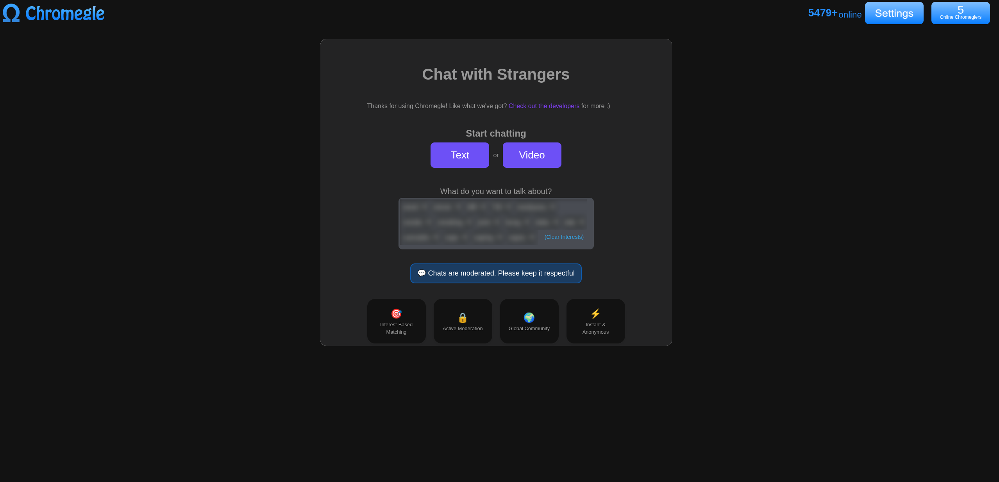
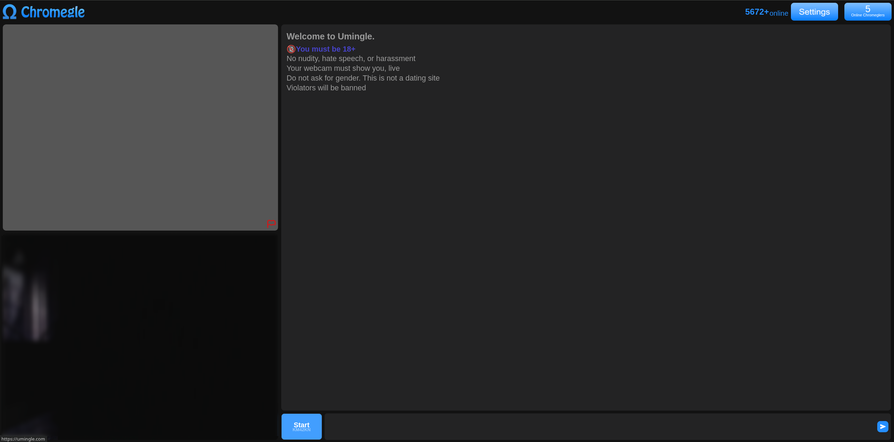
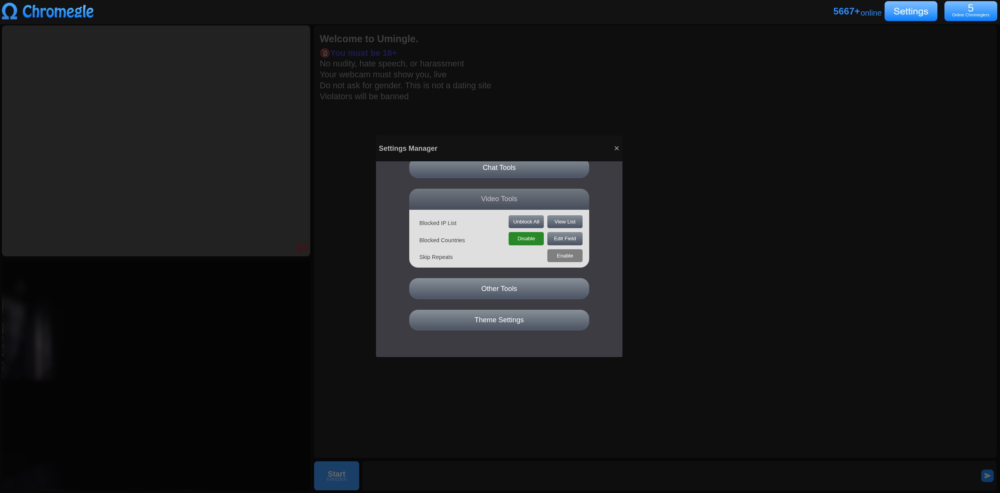
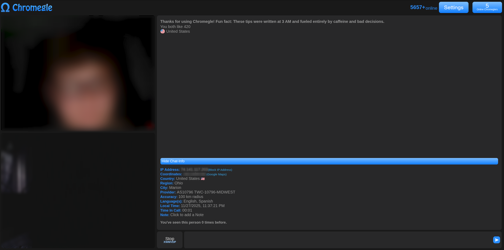
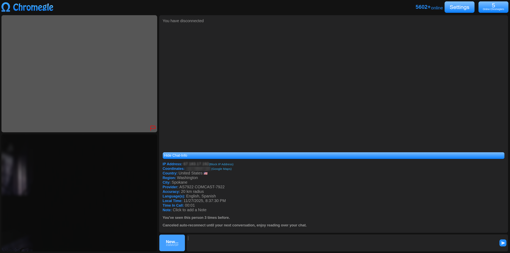

Chromegle
==================
A Javascript Chrome (and Opera) Extension for Umingle, certified for Chrome 88 and above. 

    [](https://discord.gg/422p3anb3T)
 
<a target="_blank" href="https://status.bloodmoonstudios.xyz/status/chromegle"></a><a target="_blank" href="https://status.bloodmoonstudios.xyz/status/chromegle"></a> 

# Table of Contents
- [Features](#features)
- [Installation](#installation)
- [Changelog](#changelog)
- [Authors](#authors)
- [Project License](#license)

# Features

## Working as intended
- Face Detection Bypass - NEW
- Report Detection - NEW
- Watermark Removal - NEW
- Country Blocker - Fixed
- Theme Settings - Fixed
- Geolocation
- Calltime Counter
- Voice Commands eg. omegle skip
- Ip Blocker
- "Youve seen this person x times before" counter
- Greeting Messages
- Auto-Skip
  - Repeats
- Auto-Reconnect

## Broken/Untested
- ~~Auto-Skip Timer~~
- ~~Sexual Filter~~
- ~~Profanity Filter~~

# Installation

## Standard Installation

Get the extension from the [Chrome Web Store](https://chromewebstore.google.com/detail/chromegle-reborn-umingle/kaahpgbohjcchoicicchgahmolocanbp)

## Manual Installation

Manual installation is fairly easy thanks to Chrome's great developer support:

[Download The Extension](https://github.com/xanzinfl/Chromegle/releases/download/v5.0.0/Chromegle-v5.0.0.zip)
```
1. Clone Repository or use the link above & Unzip
2. Navigate to chrome://extensions/ web-page
3. Enable "Developer Tools" on top-right of page
4. Click "Load Unpacked" on chrome://extensions/
5. Select repository directory and click OK
6. Use on https://www.umingle.com/ freely
```

# Changelog
## Recent Changes
### Whats New?
- Refactored for Umingle!
- Added Streamer Mode

> See the full changelog [Here](./CHANGELOG.md).

## Authors

* **Isaac Kogan** - *Initial work* - [isaackogan](https://github.com/isaackogan)

* **flouflouit** - *Migration to Uhmegle* - [flouflouit](https://github.com/flouflouit)

* **xanzinfl** - *Additional Feature Support, Migration to Umingle* - [xanzinfl](https://github.com/xanzinfl)

See also the list of [contributors](https://github.com/ChromegleApp/Chromegle/contributors) who participated in this project.

## License

This project is licensed under the GPL-3.0 License - see the [LICENSE](LICENSE) file for details.

## Images





