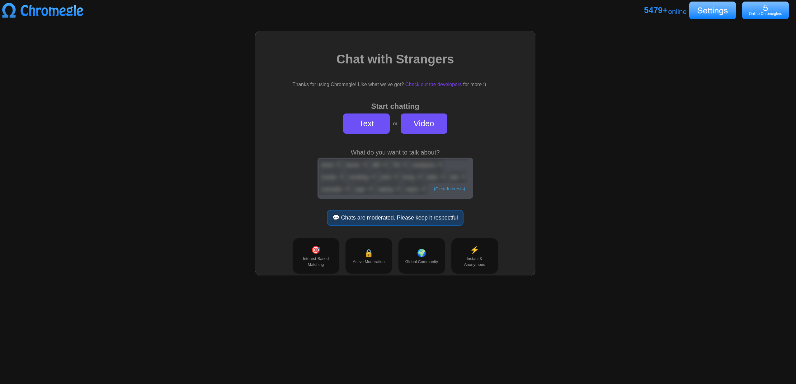
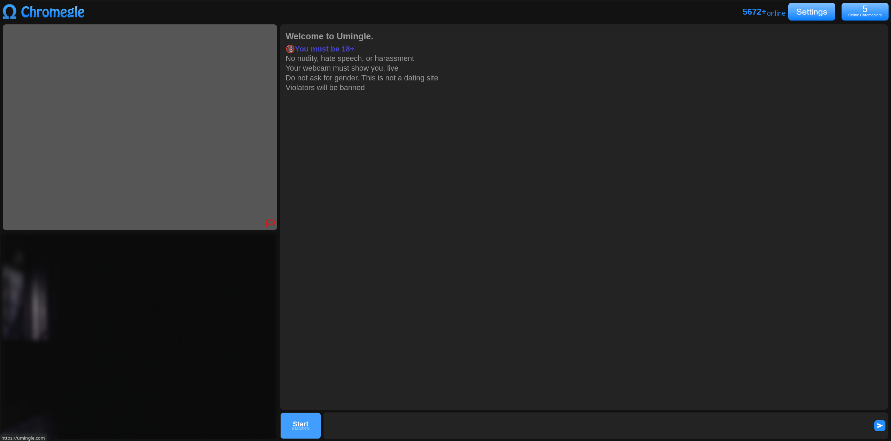
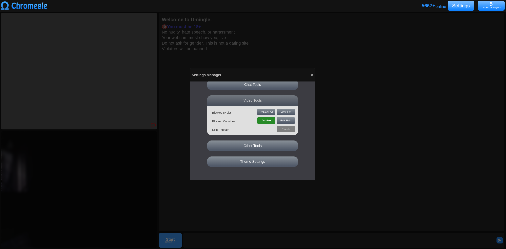
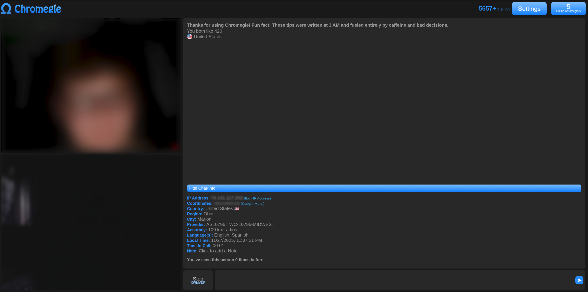
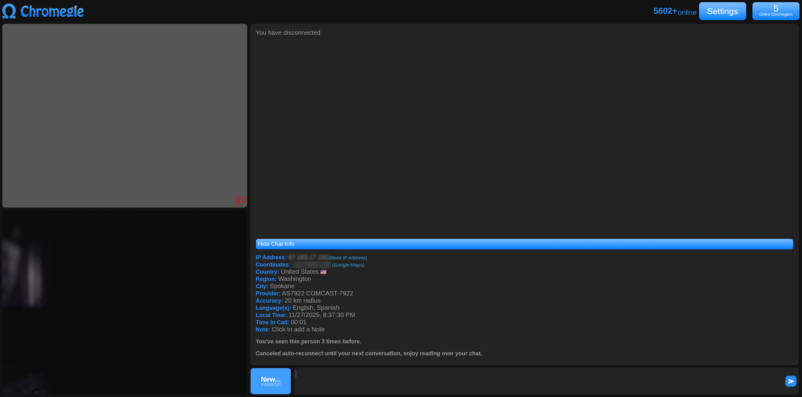

> [!NOTE]
> This project is currently unsupported, no further updates will be made **for umingle**. It is possible that it will come back on another site, if you have any recomendations, feel free to let us know!

> [!CAUTION]
> Chromegle is currently detected on umingle, you may be banned if you use it.

Chromegle
==================
A Javascript Chromium Extension for Umingle, adding automation, safety, and quality of life changes all in one.
> Compatible with Chrome 88 and above.
> Supported browsers include Chrome, Brave, Edge, Opera, and many more. 

    
 
 

# Table of Contents
- [Features](#features)
- [Installation](#installation)
- [Changelog](#changelog)
- [Authors](#authors)
- [Project License](#license)

---

# Features

### Automation
- Auto-Skip (Repeat Users)
- Auto-Reconnect
- Topics Only Mode
- Greeting Messages

### Network & Privacy
- IP Blocking
- Country Blocking
- Geolocation

### UI Enhancements
- Report Detection
- Theme Settings
- Watermark Removal
- Calltime Counter
- Streamer Mode
- "You've seen this person x times before" counter

### Voice & Input
- Voice Commands eg. omegle skip
- Paste Hotbar

### Bypasses
- Face Detection Bypass

## In Progress/Planned
- Auto-Skip Timer
- Sexual Filter
- Profanity Filter

---

# Installation

### Chrome Web Store - Recommended

Get the extension from the [Chrome Web Store](https://chromewebstore.google.com/detail/chromegle-reborn-umingle/kaahpgbohjcchoicicchgahmolocanbp)

### Manual Installation

Manual installation is fairly easy thanks to Chrome's great developer support:

1. Clone Repository or [Download The Latest Release](https://github.com/xanzinfl/Chromegle/releases/latest/download/Chromegle.zip) & unzip it
2. Navigate to `chrome://extensions/` web-page
3. Enable "Developer Tools" on top-right of page
4. Click "Load Unpacked" on chrome://extensions/
5. Select repository directory and click OK
6. Use on https://www.umingle.com/ freely

---

# Changelog
## Recent Changes
### Whats New?
- Brought back the Paste Hotbar!
- Added Streamer Mode
- Added Topics Only Mode

> See the full changelog [Here](./CHANGELOG.md).

---

## Authors

* **Isaac Kogan** - *Initial work* - [isaackogan](https://github.com/isaackogan)

* **flouflouit** - *Migration to Uhmegle* - [flouflouit](https://github.com/flouflouit)

* **xanzinfl** - *Additional Feature Support, Migration to Umingle* - [xanzinfl](https://github.com/xanzinfl)

See also the list of [contributors](https://github.com/ChromegleApp/Chromegle/contributors) who participated in this project.

## License

This project is licensed under the GPL-3.0 License - see the [LICENSE](LICENSE) file for details.

---

## Images

